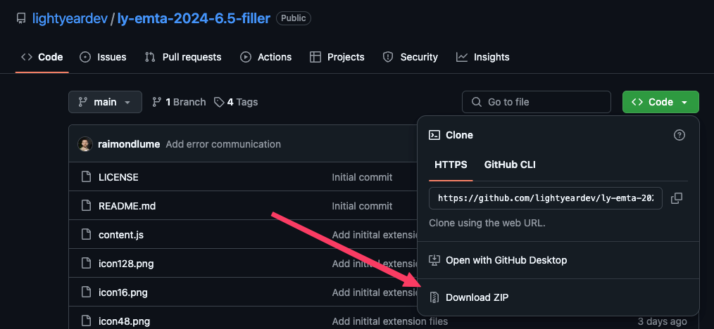
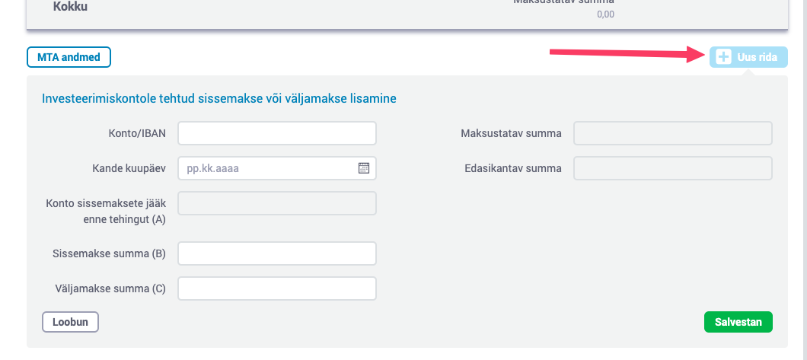

# ly-emta-2024-6.5-filler

A chrome extension that automatically adds all the rows from your Lightyear statement to Table 6.5 II in the Tax Report form.

## Installation

### From the Chrome Web Store

Download [link](https://chromewebstore.google.com/detail/emta-2024-tax-report-65-f/gglidgedbjadpgojkpgpkdneldniiocp)

### Manual Installation

1. Download the latest release [.zip file](https://github.com/lightyeardev/ly-emta-2024-6.5-filler/archive/refs/heads/main.zip)
   
2. Unpack the file
3. Go to `chrome://extensions` in your browser
4. Enable "Developer mode" in the top right corner
5. Click "Load unpacked" and select the folder where you unpacked the .zip file
6. The extension should now be installed and enabled!

## Usage

When you get to table 6.5 part 2 in the tax declaration form, first click "New row" to open the form.

Once that is open:

1. Open the extension
2. Choose the CSV file from the end of the form in the Lightyear (web)app
3. Click "Fill Form"
4. Wait for the extension to finish processing

_If nothing happens, close the extension, refresh the page and try again._

## Support

Feel free to open an issue in this repository if you have any questions or problems.
